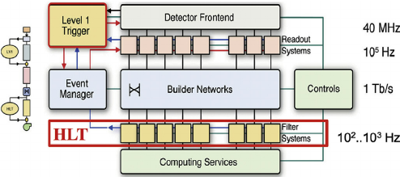
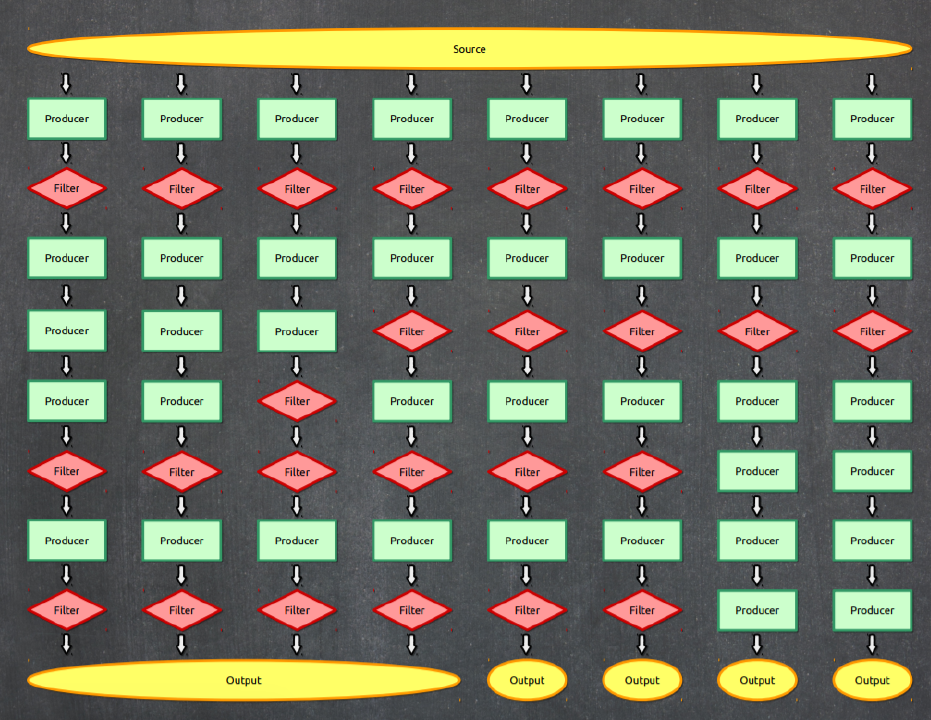

## The CMS acquisition and trigger systems

Collisions at the LHC happen at a **rate** close to 40 million per second (40 MHz).  Once each collision is *sensed* by the different subdetectors, the amount of information they generate corresponds to about what you can fit in a 1 MB file.  If we were to record every single collision, it is said (you can do the math) that one can probably fill out all the available disk space in the world in a few days!  

Not all collisions that happen at the LHC are interesting. We would like to keep the interesting ones and, most importantly, do not miss the **discovery-quality** ones.  In order to achieve that we need a *Trigger*.

Before we jump into the details for the trigger system, let's agree on some terminology:

- **Fill**: Every time the LHC injects beams in the machine it marks the beginning of what is known as a *Fill*.  

- **Run**: As collisions happen in the LHC, CMS (and the other detectors) decide whether they start *recording* data.  Every time the *start* button is pushed, a new *Run* starts and it is given a unique number. 

- **Lumi section**: while colliding, the LHC's delivered instantaneous luminosity gets degraded (although during Run 3 it will be mainly *levelled*) due to different reasons.  I.e., it is not constant over time.  For practical reasons, CMS groups the events it collects in *luminosity sections*, where the luminosity values can be considered constant.

## The trigger system

Deciding on which events to record is the main purpose of the trigger system.  It is like determining which events to record by taking a **quick picture** of it and, even though a bit blurry, decide whether it is interesting to keep or not for a future, more thorough inspection.  

CMS does this in two main steps.   The first one, the **Level 1 trigger** (L1), implemented in hardware (fast FPGAs), reduces the input rate of 40 Mhz to around 100 KHz.  The other step is the **High Level Trigger** (HLT), run on commercial machines with good-old C++ and Python, where the input rate is leveled around the maximum available budget of around 2 KHz.

{:width="60%"}

There are hundreds of different triggers in CMS.  Each one of them is designed to pick certain types of events, with different intensities and topologies.  For instance the [HLT_Mu20](https://opendata.cern.ch/record/23438) trigger, will select events with at least one muon with *20 GeV* of transverse momentum.  

At the HLT level, which takes L1 as input, triggers are **implemented using CMSSW code** using pieces of it (*modules*) that can be arranged to achieve the desired result: selecting specific kinds of events.  Computationally, triggers are just *Paths* in the CMSSW sense, and one could extract a lot of information by exploring the Python configuration of these paths.

At the end of the configuration file, we could have something like

~~~
process.mypath = cms.Path (process.m1+process.m2+process.s1+process.m3)
~~~
{: .language-python}

, where `m1`, `m2`, `m3` could be CMSSW modules (individual EDAnalyzers, EDFilters, EDProducers, etc.) and `s1` could be a [Sequence of modules](https://twiki.cern.ch/twiki/bin/view/CMSPublic/SWGuideAboutPythonConfigFile#Module_sequences).

An example of such an arrangement for an HLT trigger looks like:

~~~
process.HLT_Mu20_v2 = cms.Path( process.HLTBeginSequence + process.hltL1sL1SingleMu16 + process.hltPreMu20 + process.hltL1fL1sMu16L1Filtered0 + process.HLTL2muonrecoSequence + process.hltL2fL1sMu16L1f0L2Filtered10Q + process.HLTL3muonrecoSequence + process.hltL3fL1sMu16L1f0L2f10QL3Filtered20Q + process.HLTEndSequence )
~~~
{: .language-python}

Finally, triggers are code, and those pieces of code are constantly changing.  Modifications to a trigger could imply a different version identifier.  For instance, our `HLT_Mu20` could actually be `HLT_Mu15_v1` or `HLT_Mu15_v2`, etc., depending on the version.  Therefore, it is completely normal that the trigger names can **change from run to run**.

## Prescales

The need for prescales (and its meaning) is evident if one thinks of different physics processes having different cross sections.  It is a lot more likely to record one minimum bias event, than an event where a Z boson is produced.  Even less likely is to record an event with a Higgs boson.  We could have triggers named, say, `HLT_ZBosonRecorder` for the one in charge of filtering Z-carrying events, or `HLT_HiggsBosonRecorder` for the one accepting Higgses (the actual names are more sophisticated and complex than that, of course.)   The *prescales are designed to keep these inputs under control* by, for instance, recording just 1 out of 100 collisions that produce a likely Z boson, or 1 out of 1 collisions that produce a potential Higgs boson.  In the former case, the prescale would be 100, while for the latter it would be 1; if a trigger has a prescale of 1, i.e., records every single event it identifies, we call it **unprescaled**.

Maybe not so evident is the need for trigger prescale changes for keeping up with luminosity changes.  As the luminosity drops, prescales can be relaxed, and therefore **could change from to run** in the same fill.

A trigger can be prescaled at L1 as well as the HLT levels.  L1 triggers have their own nomenclature and can be used as HLT trigger **seeds**.

## Triggers, streams and datasets

After events are accepted by possibly more than one type of trigger, they are streamed in different categories, called **streams** and then classified and arranged in primary **datasets**.  Most, but not all, of the datasets belonging to the stream A, the physics stream, are or will become available as CMS Open Data. 

Finally, it is worth mentioning that:

- an event can be triggered by many trigger paths
- trigger paths are unique to each dataset
- **the same event can arrive in two different datasets** (this is speciall important if working with many datasets as event duplication can happen and one has to account for it)


