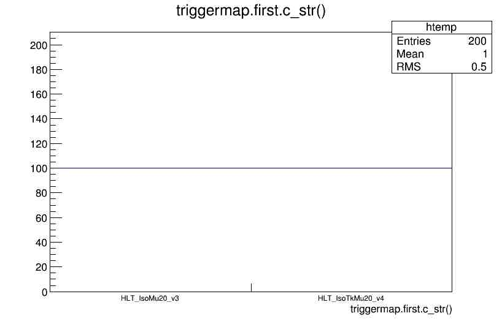
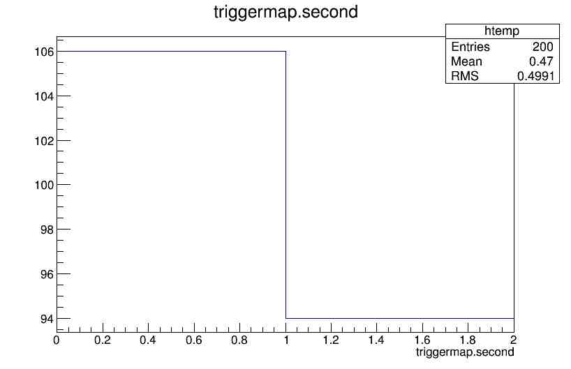

## The HLTConfigProvider and HLTPrescaleProvider

While it is true that one can get most of the trigger information needed directly from the miniAOD files, like we found out in the last episode, there are some cases when this information is not enough.  An example is the case of multi-object triggers.  If one needs to study a trigger in detail it is likely that the [HLTConfigProvider](https://github.com/cms-sw/cmssw/blob/CMSSW_7_6_X/HLTrigger/HLTcore/interface/HLTConfigProvider.h) and the [HLTPrescaleProvider](https://github.com/cms-sw/cmssw/blob/CMSSW_7_6_X/HLTrigger/HLTcore/interface/HLTPrescaleProvider.h) classes are needed. As you can check for yourself these clases have several methods to extract a lot of trigger-related information. Several of those, like the ones related to prescale extraction, need access to the **conditions DB**.  Fortunately, we already included that in the pre-exercises to get the *transients tracks* built correctly. We will cover a couple of examples.

## Accessing trigger prescales and acceptance bits (Optional / Offline)

We already have a POET analyzer that uses the above clases.  It has been implemented as `src/TriggerAnalyzer.cc`.  The corresponding module in the `python/poet_cfg.py` is called `mytriggers`.  It has been commented out so for this exercise will uncomment those lines:  After you open the `poet_cfg.py` file and edit it, the snippet should should look like:

~~~
#---- Example on how to add trigger information
#---- To include it, uncomment the lines below and include the
#---- module in the final path
process.mytriggers = cms.EDAnalyzer('TriggerAnalyzer',
                              processName = cms.string("HLT"),
                              #---- These are example of OR of triggers for 2015
                              #---- Wildcards * and ? are accepted (with usual meanings)
                              #---- If left empty, all triggers will run              
                              triggerPatterns = cms.vstring("HLT_IsoMu20_v*","HLT_IsoTkMu20_v*"), 
                              triggerResults = cms.InputTag("TriggerResults","","HLT")
                              )
~~~
{: .language-python}

Note that the configuration file accepts sevaral triggers and wildcards.  The combination is an **OR** of the triggers.

Let's include this module in the final paths at the end of the `poet_cfg.py` file.  Let's replace the `mysimpletrig` module so we don't pollute the print out.

~~~
if isData:
 process.p = cms.Path(process.mytriggers+process.hltHighLevel+process.elemufilter+process.myelectrons+process.mymuons+process.mytaus+process.myphotons+process.mypvertex+process.mysimpletrig+
                             process.looseAK4Jets+process.patJetCorrFactorsReapplyJEC+process.slimmedJetsNewJEC+process.myjets+
                             process.looseAK8Jets+process.patJetCorrFactorsReapplyJECAK8+process.slimmedJetsAK8NewJEC+process.myfatjets+
                             process.uncorrectedMet+process.uncorrectedPatMet+process.Type1CorrForNewJEC+process.slimmedMETsNewJEC+process.mymets
                             )
else:
 process.p = cms.Path(process.mytriggers+process.hltHighLevel+process.elemufilter+process.myelectrons+process.mymuons+process.mytaus+process.myphotons+process.mypvertex+process.mysimpletrig+
                             process.mygenparticle+process.looseAK4Jets+process.patJetCorrFactorsReapplyJEC+
                             process.slimmedJetsNewJEC+process.myjets+process.looseAK8Jets+process.patJetCorrFactorsReapplyJECAK8+
                             process.slimmedJetsAK8NewJEC+process.myfatjets+process.uncorrectedMet+process.uncorrectedPatMet+
                             process.Type1CorrForNewJEC+process.slimmedMETsNewJEC+process.mymets
                             )
~~~
{: .language-python}

Let's run POET with the usual `cmsRun python/poet_cfg.py True`.

Let's explore the output, i.e., let's open the `myoutput.root` file.

> ## Special Mac chip users:
> You can download this file from the web and investigate it in the ROOT container.
> ~~~
> wget https://jmhogan.web.cern.ch/jmhogan/OpenData/myoutput_triggerMuons.root
> ~~~
> {: .language-bash}
{: .prereq}

~~~
root -l myoutput.root
~~~
{: .language-bash}

This is what you will see for the `mytriggers` map *first* and *second*.  The *first* of this map is the name of the trigger and the *second* is the product of $$\text{L1 prescale}\times\text{HLT prescale}\times\text{acceptance bit}$$.

<table align="center">
    <tr>
      <th></th>
      <th></th>
    </tr>  
</table>

Explore the code and get ready for the last challenge:

> ## Dump the dataset triggers (Optional / Offline)
> 
> As an example of the kind of information you can retrieve using the *HLTConfigProvider* class, try to dump all the triggers that belong to all the datasets for a specific run.
> 
> Some hints:
> * Note that the *HLTConfigProvider* (or its cousin, the *HLTPrescaleProvider*) initialize every run.  This is because the HLT *menu* can change from to run to run, as it was mentioned before.
> * There is a method in the HLTPrescaleProvider class to access the HLTConfigProvider (actually it is used in the code)
> * There is already a method in the HLTConfigProvider to dump (print out) the triggers for each dataset.  It is called `dump` and you can pass the string "Datasets" to it.
> * Don't forget to recompile before running.
>
> > ## Solution
> >
> > Modify the `src/TriggerAnalyzer.cc` file to add the one-liner `hltPrescaleProvider_.hltConfigProvider().dump("Datasets");` in the `beginRun` function:
> >
> > ~~~
> > // ------------ method called when starting to processes a run  ------------
> > void TriggerAnalyzer::beginRun(edm::Run const& iRun, edm::EventSetup const& iSetup)
> > //--------------------------------------------------------------------------
> > {
> >     using namespace std;
> >     using namespace edm;
> > 
> >     bool changed(true);
> >     hltPrescaleProvider_.init(iRun,iSetup,processName_,changed);
> >     if (changed){
> >       cout<<"HLTConfig has changed for this Run. . . "<<endl;
> >       hltPrescaleProvider_.hltConfigProvider().dump("Datasets");
> >    }
> > } //------------------- beginRun()
> > ~~~
> > {: .language-cpp}
> >
> > This is the final [TriggerAnalyzer.cc](https://raw.githubusercontent.com/cms-opendata-analyses/PhysObjectExtractorTool/odws2022-ttbaljets-prod/PhysObjectExtractor/trunk/TriggerAnalyzer.cc_2) file and the [poet_cfg.py](https://github.com/cms-opendata-analyses/PhysObjectExtractorTool/blob/odws2022-ttbaljets-prod/PhysObjectExtractor/trunk/poet_cfg.py_2) config file.
> {: .solution}
{: .challenge}


